# ⚡ Smart Grid ML - Geolocation-Based Electricity Price Prediction


A machine learning system for predicting electricity prices at **any location in California** using geographic coordinates. Leverages 4,300+ CAISO pricing nodes, NOAA weather stations, and power plant data for accurate Locational Marginal Price (LMP) predictions.

## 🎯 Key Features

- **🗺️ Geolocation-Based**: Predict prices for any latitude/longitude in California
- **📍 Address Search**: Enter any California address via Google Maps integration
- **🔌 4,300+ CAISO Nodes**: Full California ISO pricing node coverage
- **🌡️ Weather-Aware**: Real-time weather interpolation from NOAA stations
- **⚡ Power Plant Proximity**: Spatial features from nearby generation facilities
- **🐳 Docker-Ready**: Containerized training and deployment pipeline
- **☁️ Cloud Run**: One-command deployment to Google Cloud

---

## 📋 Table of Contents

- [Architecture](#architecture)
- [Quick Start](#quick-start)
- [Data Pipeline](#data-pipeline)
- [API Reference](#api-reference)
- [Docker Deployment](#docker-deployment)
- [Cloud Run Deployment](#cloud-run-deployment)
- [Configuration](#configuration)
- [Model Details](#model-details)
- [Troubleshooting](#troubleshooting)

---

## 🏗️ Architecture


### Component Overview

| Component | File | Purpose |
|-----------|------|---------|
| **Geo App** | `app_geo.py` | Flask API with login, prediction endpoints |
| **Geo Training** | `train_geo.py` | Neural network training pipeline |
| **Feature Builder** | `geo_features.py` | Spatial feature engineering |
| **Data Downloader** | `download_geo.py` | CAISO price data fetcher |
| **Node Manager** | `caiso_nodes.py` | California node extraction & lookup |
| **Geo Utilities** | `geo_utils.py` | Haversine distance, bounds checking |

---

## 🚀 Quick Start

### Prerequisites

- Docker & Docker Compose
- Google Maps API Key (for address search)

### 1. Clone & Configure

```bash
git clone https://github.com/nicechester/smart-grid-prediction.git
cd smart-grid-prediction

# Create .env file
cat > .env << EOF
GOOGLE_MAPS_API_KEY=your_google_maps_api_key
AUTH_USERNAME=user
AUTH_PASSWORD=2026
SECRET_KEY=your-secret-key-here
EOF
```

### 2. Download Data

```bash
# Download CAISO prices for sample nodes (takes ~1 hour for 100 nodes)
docker-compose -f docker-compose-downloader.yml up
```

### 3. Train Model

```bash
# Build features and train model
docker-compose up trainer
```

### 4. Start API

```bash
# Start the prediction service
docker-compose up app
```

### 5. Access Web UI

Open http://localhost:8001 and login with:
- Username: `user`
- Password: `2026`

---

## 📊 Data Pipeline

```mermaid
flowchart LR
    subgraph Download["1️⃣ Download"]
        A["CAISO OASIS API"] --> B["geo_prices.pkl"]
        C["caiso-price-map.json"] --> D["caiso_nodes_california.json"]
    end
    
    subgraph Features["2️⃣ Feature Engineering"]
        B --> E["geo_features.py"]
        F["stations.json\nNOAA Weather"] --> E
        G["power_plants.pkl"] --> E
        E --> H["geo_training.pkl"]
    end
    
    subgraph Train["3️⃣ Training"]
        H --> I["train_geo.py"]
        I --> J["geo_model.keras"]
        I --> K["geo_scaler.pkl"]
        I --> L["geo_features.json"]
    end
    
    subgraph Serve["4️⃣ Serving"]
        J --> M["app_geo.py"]
        K --> M
        L --> M
        M --> N["REST API"]
    end
```



### Data Sources

| Source | Description | Update Frequency |
|--------|-------------|------------------|
| **CAISO OASIS** | Locational Marginal Prices (LMP) | Historical (training) |
| **NOAA GHCND** | Weather stations across California | Daily |
| **CartoDB** | Power plant locations & capacity | Static |
| **caiso-price-map.json** | 4,300+ California pricing nodes | Static |

### Feature Categories

**Spatial Features:**
- Latitude, Longitude
- Distance to nearest power plant
- Plants within 50km radius
- Total generation capacity nearby
- Average price of neighboring nodes

**Temporal Features:**
- Hour (sin/cos encoded)
- Month (sin/cos encoded)
- Day of week
- Is weekend flag

**Weather Features:**
- Temperature (interpolated from nearby stations)
- Wind speed
- Precipitation
- Cloud cover

**Lag Features:**
- Price history (1, 3, 6, 12 hour lags)
- Temperature history
- Solar/Wind generation history

---

## 🔌 API Reference

### Predict by Coordinates

```bash
GET /predict/geo?latitude=34.05&longitude=-118.24
```

**Response:**
```json
{
  "predicted_price": 45.23,
  "price_level": "MEDIUM",
  "description": "Normal grid conditions",
  "location": {
    "latitude": 34.05,
    "longitude": -118.24
  },
  "nearest_node": {
    "node_id": "DTLA_1_N001",
    "distance_km": 2.5,
    "area": "SCE"
  },
  "timestamp": "2026-01-12T10:30:00"
}
```

### Predict by Address

```bash
GET /predict/address?address=1600+Amphitheatre+Parkway,+Mountain+View,+CA
```

**Response:**
```json
{
  "predicted_price": 38.50,
  "price_level": "MEDIUM",
  "address": {
    "input": "1600 Amphitheatre Parkway, Mountain View, CA",
    "formatted": "1600 Amphitheatre Pkwy, Mountain View, CA 94043, USA"
  },
  "location": {
    "latitude": 37.4220,
    "longitude": -122.0841
  }
}
```

### Find Nearby Nodes

```bash
GET /nodes/nearby?latitude=34.05&longitude=-118.24&radius_km=25&limit=10
```

### Health Check

```bash
GET /geo/health
```

### Model Info

```bash
GET /geo/model-info
```

---

## 🐳 Docker Deployment

### Docker Compose Services

| Service | Purpose | Command |
|---------|---------|---------|
| `downloader` | Fetch CAISO prices | `docker-compose -f docker-compose-downloader.yml up` |
| `trainer` | Build features & train | `docker-compose up trainer` |
| `app` | Run prediction API | `docker-compose up app` |

### Volume Mounts

```yaml
volumes:
  - ./src:/app/src       # Source code
  - ./data:/app/data     # Models, downloads, logs
  - ./templates:/app/templates  # HTML templates
```

### Environment Variables

| Variable | Description | Required |
|----------|-------------|----------|
| `GOOGLE_MAPS_API_KEY` | Google Maps API for address geocoding | Yes (for address search) |
| `AUTH_USERNAME` | Login username (default: user) | No |
| `AUTH_PASSWORD` | Login password (default: 2026) | No |
| `SECRET_KEY` | Flask session secret | No |
| `PORT` | API port (default: 8001) | No |

---

## ☁️ Cloud Run Deployment

### Prerequisites

1. Google Cloud SDK installed
2. Project with billing enabled
3. Artifact Registry API enabled

### Deploy

```bash
# Set your project
export GCP_PROJECT=your-project-id

# Deploy (builds, pushes, and deploys)
./deploy-to-cloudrun.sh
```

The script will:
1. Verify model files exist
2. Build Docker image
3. Push to Google Artifact Registry
4. Deploy to Cloud Run with 2GB memory
5. Pass `GOOGLE_MAPS_API_KEY` from `.env`

---

## ⚙️ Configuration

### Training Configuration (`train_geo.py`)

```python
class GeoModelConfig:
    EPOCHS = 100
    BATCH_SIZE = 64
    LEARNING_RATE = 0.001
    HIDDEN_LAYERS = [128, 64, 32]
    DROPOUT_RATE = 0.2
    TEST_SIZE = 0.2
    EARLY_STOPPING_PATIENCE = 10
```

### Download Configuration (`download_geo.py`)

```python
# Sample size (for testing)
SAMPLE_SIZE = 100  # Number of nodes to download

# Date range
START_DATE = "2023-01-01"
END_DATE = "2025-12-31"

# Rate limiting
RATE_LIMIT_DELAY = 2.0  # Seconds between API calls
```

---

## 🤖 Model Details

### Neural Network Architecture


### Training Process

1. **Data Loading**: Load `geo_training.pkl` with all engineered features
2. **Split**: 80% train, 20% test (shuffled)
3. **Scaling**: StandardScaler fit on training data only
4. **Training**: Adam optimizer with early stopping & LR reduction
5. **Evaluation**: MAE, RMSE, MAPE, R² on test set
6. **Export**: Model, scaler, feature names, and metadata

### Output Files

```
data/models/
├── geo_model.keras      # TensorFlow model
├── geo_scaler.pkl       # StandardScaler
├── geo_features.json    # Feature name list
└── geo_metadata.json    # Training metrics & config
```

---

## 🐛 Troubleshooting

### Model Not Loading

```bash
# Verify model files exist
ls -la data/models/

# Should show:
# geo_model.keras
# geo_scaler.pkl
# geo_features.json
# geo_metadata.json

# If missing, run training:
docker-compose up trainer
```

### CAISO API Issues

```bash
# Check download logs
cat data/downloads/download_geo.log

# Common issues:
# - Rate limiting: increase RATE_LIMIT_DELAY
# - Empty responses: node may not have data for date range
# - Timeout: increase REQUEST_TIMEOUT
```

### Google Maps API Error

```bash
# Verify API key is set
grep GOOGLE_MAPS_API_KEY .env

# Test geocoding
curl "https://maps.googleapis.com/maps/api/geocode/json?address=Los+Angeles,+CA&key=YOUR_KEY"
```

### Port Already in Use

```bash
# Find process using port
lsof -i :8001

# Kill it
kill -9 <PID>

# Or use different port
PORT=8002 docker-compose up app
```

### View Logs

```bash
# Training logs
cat data/training/train_geo.log

# Download logs
cat data/downloads/download_geo.log

# API logs
cat data/prediction/app_geo.log

# Docker logs
docker-compose logs -f app
```

---

## 📁 Project Structure

```
tier3_poc/
├── src/
│   ├── app_geo.py          # Flask API (main entry point)
│   ├── train_geo.py        # Model training
│   ├── geo_features.py     # Feature engineering
│   ├── download_geo.py     # CAISO data downloader
│   ├── caiso_nodes.py      # Node management
│   ├── geo_utils.py        # Geospatial utilities
│   ├── tier2_pipeline.py   # Data fetchers (NOAA, CartoDB)
│   └── stations.json       # NOAA weather stations
│
├── data/
│   ├── downloads/          # Raw downloaded data
│   │   ├── geo_prices.pkl
│   │   ├── power_plants.pkl
│   │   └── weather_data.pkl
│   ├── models/             # Trained model artifacts
│   │   ├── geo_model.keras
│   │   ├── geo_scaler.pkl
│   │   └── geo_features.json
│   ├── training/           # Training logs
│   └── prediction/         # API logs
│
├── templates/
│   ├── index.html          # Main web UI
│   └── login.html          # Login page
│
├── docker-compose.yml              # Training & app services
├── docker-compose-downloader.yml   # Download service
├── Dockerfile                      # Base image
├── Dockerfile.cloudrun             # Cloud Run image
├── deploy-to-cloudrun.sh           # GCP deployment script
├── requirements.txt                # Python dependencies
├── .env                            # Environment variables
└── README.md                       # This file
   ```

---

## 📈 Future Enhancements

- [ ] Real-time price updates via CAISO API
- [ ] Multi-step forecasting (24-hour ahead)
- [ ] Transformer/LSTM architecture for time series
- [ ] Additional weather features (humidity, pressure)
- [ ] Solar irradiance data (NREL)
- [ ] EV charging demand integration
- [ ] Model explainability (SHAP values)
- [ ] Kubernetes deployment

---

## 📄 License

MIT License - see [LICENSE](LICENSE) for details.

---

**Built with ❤️ for a sustainable energy future**
