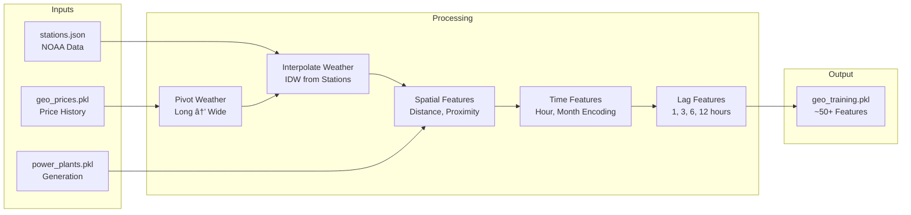

# 🏗️ Architecture: Geolocation-Based Price Prediction

This document provides a detailed technical overview of the Smart Grid ML system architecture for predicting electricity prices based on geographic coordinates.

---

## System Overview

The system predicts California ISO (CAISO) Locational Marginal Prices (LMP) for any latitude/longitude coordinate in California. It uses a deep learning model trained on historical prices from 4,300+ CAISO nodes combined with weather, power plant proximity, and temporal features.


---

## Core Components

### 1. Data Layer

#### CAISO Nodes (`caiso_nodes.py`)

Manages the 4,300+ California ISO pricing nodes extracted from `caiso-price-map.json`.


**Key Functions:**
- `get_california_nodes()` - Load all CA nodes from JSON
- `find_nearest_node(lat, lon)` - Find closest pricing node to coordinates
- `export_california_nodes()` - Generate `caiso_nodes_california.json`

#### Price Downloader (`download_geo.py`)

Fetches historical LMP prices from CAISO OASIS API.


**CAISO API Details:**
- Endpoint: `http://oasis.caiso.com/oasisapi/SingleZip`
- Query Type: `PRC_LMP`
- Market: `DAM` (Day-Ahead Market)
- Format: ZIP containing CSV
- Rate Limit: 2 second delay between requests

### 2. Feature Engineering Layer (`geo_features.py`)

Transforms raw data into ML-ready features.



**Feature Categories:**

| Category | Features | Description |
|----------|----------|-------------|
| **Spatial** | `latitude`, `longitude`, `distance_to_nearest_plant_km`, `plants_within_50km`, `total_capacity_within_50km`, `avg_price_neighbors_25km` | Location-based features |
| **Temporal** | `hour_sin`, `hour_cos`, `month_sin`, `month_cos`, `day_of_week`, `is_weekend` | Cyclical time encoding |
| **Weather** | `temperature`, `wind_speed`, `precipitation`, `cloud_cover` | Interpolated from nearby stations |
| **Generation** | `solar_mw`, `wind_mw`, `total_demand`, `renewable_pct` | Derived from weather/time |
| **Lag** | `price_lag_1`, `price_lag_3`, `price_lag_6`, `price_lag_12`, etc. | Historical values |

### 3. Model Layer (`train_geo.py`)

#### Neural Network Architecture


#### Training Pipeline


#### Model Configuration

```python
class GeoModelConfig:
    # Training
    EPOCHS = 100
    BATCH_SIZE = 64
    LEARNING_RATE = 0.001
    VALIDATION_SPLIT = 0.2
    EARLY_STOPPING_PATIENCE = 10
    
    # Architecture
    HIDDEN_LAYERS = [128, 64, 32]
    DROPOUT_RATE = 0.2
    
    # Data
    TEST_SIZE = 0.2
    RANDOM_STATE = 42
```

### 4. Serving Layer (`app_geo.py`)

Flask application serving predictions via REST API.


#### Prediction Flow


---

## Data Flow

### Training Data Flow


### Prediction Data Flow


---

## Deployment Architecture

### Docker Compose Architecture


### Cloud Run Architecture


---

## Security

### Authentication Flow


### Environment Variables

| Variable | Purpose | Storage |
|----------|---------|---------|
| `GOOGLE_MAPS_API_KEY` | Google Maps geocoding | `.env` (gitignored) |
| `AUTH_USERNAME` | Login username | `.env` or default |
| `AUTH_PASSWORD` | Login password | `.env` or default |
| `SECRET_KEY` | Flask session encryption | `.env` or default |

---

## File Structure

```
tier3_poc/
├── src/
│   ├── app_geo.py           # Flask API entry point
│   ├── train_geo.py         # Model training
│   ├── geo_features.py      # Feature engineering
│   ├── download_geo.py      # CAISO data fetcher
│   ├── caiso_nodes.py       # Node management
│   ├── geo_utils.py         # Geospatial utilities
│   ├── tier2_pipeline.py    # NOAA/CartoDB fetchers
│   └── stations.json        # NOAA station list
│
├── data/
│   ├── downloads/           # Raw data
│   │   ├── geo_prices.pkl
│   │   ├── power_plants.pkl
│   │   └── download_geo.log
│   ├── models/              # Trained artifacts
│   │   ├── geo_model.keras
│   │   ├── geo_scaler.pkl
│   │   ├── geo_features.json
│   │   └── geo_metadata.json
│   ├── training/            # Training logs
│   │   └── train_geo.log
│   └── prediction/          # API logs
│       └── app_geo.log
│
├── templates/
│   ├── index.html           # Main UI
│   └── login.html           # Login page
│
├── docker-compose.yml               # Trainer + App
├── docker-compose-downloader.yml    # Downloader
├── Dockerfile                       # Base image
├── Dockerfile.cloudrun              # Production image
└── deploy-to-cloudrun.sh            # GCP deploy script
```

---

## Performance Considerations

### Training Performance

| Metric | Typical Value | Notes |
|--------|---------------|-------|
| Training Time | 5-15 min | Depends on data size |
| Memory Usage | 2-4 GB | TensorFlow + pandas |
| Disk Usage | 100-500 MB | Model + training data |

### Inference Performance

| Metric | Typical Value | Notes |
|--------|---------------|-------|
| Cold Start | 3-5 sec | Model loading |
| Inference | 10-50 ms | Per prediction |
| Memory | 500 MB - 1 GB | Model in memory |

### Scaling Recommendations

- **Cloud Run**: Set min instances = 1 to avoid cold starts
- **Memory**: 2 GB minimum for model + feature building
- **Concurrency**: 80 requests/instance (default is fine)

---

## Monitoring

### Log Locations

| Log | Path | Purpose |
|-----|------|---------|
| Download | `data/downloads/download_geo.log` | CAISO fetch progress |
| Features | `data/downloads/geo_features.log` | Feature building |
| Training | `data/training/train_geo.log` | Model training |
| API | `data/prediction/app_geo.log` | Request/response logging |

### Health Checks

```bash
# Check model loaded
curl http://localhost:8001/geo/health

# Check model details
curl http://localhost:8001/geo/model-info
```

---

## Extensibility

### Adding New Features

1. Add feature calculation in `geo_features.py` → `GeoFeatureBuilder`
2. Update `TRAINING_FEATURES` list in `train_geo.py`
3. Retrain model
4. Update `build_prediction_features()` in `app_geo.py`

### Adding New Data Sources

1. Create fetcher in `tier2_pipeline.py`
2. Add to download pipeline in `download_geo.py`
3. Integrate in `geo_features.py`

### Model Architecture Changes

1. Modify `GeoModelConfig` in `train_geo.py`
2. Update `GeoPricePredictor.build_model()`
3. Retrain and deploy
